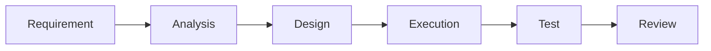

# MindAgentGraph ComfyUI 式 AI 工程工作流规划

## 1. 背景

MindAgentGraph 的目标不应该只是把 Claude Code、Codex、Cursor 这类 AI 编程工具包装成多个节点。

如果每个节点都只是一次独立的 Agent 调用，那么画布只会变成“多个聊天框的可视化版本”，节点系统的价值会很弱，甚至会增加额外的心智负担。

更有价值的方向是参考 ComfyUI 的工作流模式：

```text
节点不是一个个会聊天的 Agent，
而是一个个输入输出明确、可组合、可复用的工作流算子。
```

MindAgentGraph 应该成为面向 AI 编程任务的工作流系统，而不是另一个 AI IDE。

## 2. 产品定位

MindAgentGraph 的新定位：

```text
面向 AI 软件工程的可视化工作流编排工具。
```

它的核心价值不是“生成更多代码”，而是把常见 AI 工程流程沉淀为可复用的节点图：

- 需求澄清
- 项目分析
- 设计规划
- 文件作用域控制
- 代码执行
- 测试验证
- Review
- 修复闭环
- 结果归档

这些流程可以被保存、复用、替换参数、组合成模板，并在不同项目中重复使用。

## 3. 与 Claude Code 的区别

Claude Code 擅长在一次上下文里完成复杂任务，但它的问题是：

- 流程主要存在于聊天记录中，不容易复用。
- 每次任务都需要重新组织上下文。
- 中间产物不够结构化。
- 分析、计划、执行、测试、Review 容易混在一起。
- 很难把一次成功经验沉淀成可重复运行的工作流。

MindAgentGraph 要解决的是这些问题。

它不应该替代 Claude Code，而应该把 AI 工程过程拆成稳定的工作流节点，让外部模型或内置 runner 成为某些节点的执行引擎。

## 4. 核心原则

### 4.1 节点是算子，不是模块

节点不应该默认表示“系统模块”。

例如 Planning 节点生成的“UI 模块、状态模块、测试模块”不一定应该变成一个个 Execution 节点。模块图是设计产物，不是执行计划本身。

更合理的做法是：

- 模块设计用于帮助理解系统结构。
- Execution 节点用于执行一次可验证的改动批次。
- 工作流节点代表工程流程中的处理步骤。

### 4.2 节点必须有明确输入输出

每个节点都应该回答：

- 它读取什么输入？
- 它产出什么结构化结果？
- 下游节点如何消费它？
- 它是否会修改项目文件？
- 它的结果是否可以缓存或复用？

节点输出不应该只是一段聊天文本，而应该逐步结构化。

### 4.3 工作流可复用优先于 Tool Trace 可复用

当前的 `Save as Skill` 更像保存 Execution 内部工具调用轨迹。

这有调试价值，但层级太低，像“录屏宏”。

真正应该复用的是完整工程流程，例如：

```text
Requirement -> Analysis -> Design -> File Scope -> Execution -> Test -> Review
```

因此未来的复用能力应该从 `Save as Skill` 升级为：

```text
Save Workflow Template
```

保存的是节点图、输入输出契约、默认参数和运行策略，而不是某一次具体工具调用序列。

### 4.4 中间产物可见、可编辑、可传递

ComfyUI 的价值之一是中间产物可见。

MindAgentGraph 也应该让每个阶段的产物清晰可见：

- Analysis 输出相关文件、架构摘要、风险点。
- Design 输出 Mermaid 设计图、实施步骤、验收标准。
- File Scope 输出允许修改和禁止修改的路径。
- Execution 输出改动摘要、changed files、diff、测试建议。
- Test 输出命令、stdout、stderr、失败原因。
- Review 输出问题列表和修复建议。

用户可以编辑这些中间产物，再让下游节点继续执行。

## 5. 推荐节点体系

### 5.1 数据节点

数据节点负责保存稳定输入或产物。

建议节点：

- `Requirement`
- `Memory`
- `File Scope`
- `Design Spec`
- `Test Result`
- `Diff`
- `Project Context`

这些节点通常不直接调用模型或修改文件。

### 5.2 处理节点

处理节点负责把输入转换成输出。

建议节点：

- `Analyze Project`
- `Generate Design`
- `Build Context`
- `Execute Change`
- `Run Tests`
- `Review Diff`
- `Fix Issues`
- `Summarize Result`

这些节点是工作流真正的算子。

### 5.3 执行节点

执行节点是有副作用的节点，可以读取文件、修改文件、运行命令。

执行节点应该保持少量、清晰、可验证。

不建议：

```text
一个设计模块 = 一个 Execution 节点
```

建议：

```text
一个可验证的改动批次 = 一个 Execution 节点
```

例如：

- Execution 1：实现核心数据结构
- Execution 2：接入 UI
- Execution 3：补测试并修复失败

## 6. Planning 节点的新定位

Planning 节点不应该主要负责生成真实子节点。

它更适合成为一个“设计产物生成器”：

```text
Requirement + Analysis -> Design Spec
```

输出应包含：

- 目标
- 设计图
- 模块关系
- 实施步骤
- 文件作用域建议
- 风险
- 验收标准

推荐输出格式：

```md
## Goal

...

## Design Graph



## Implementation Steps

1. ...
2. ...
3. ...

## Recommended File Scope

- allow: ...
- deny: ...

## Acceptance Criteria

- ...
```

这样 Planning 的输出天然可以被下游 Execution 读取，不需要额外把内部图传给下游。

## 7. Analysis 节点的新定位

Analysis 节点应该是只读项目理解节点。

它不修改文件，只负责输出：

- 项目结构
- 相关入口
- 相关文件
- 当前实现方式
- 潜在风险
- 建议修改位置
- 建议验证命令

Analysis 的价值是降低 Execution 的盲目性，让执行节点在更准确的上下文中修改代码。

## 8. Execution 节点的新定位

Execution 节点负责真正改代码。

它应该读取上游结构化产物：

- Requirement
- Analysis
- Design Spec
- File Scope
- Memory

然后产出：

- 修改摘要
- changed files
- diff
- 测试结果
- 后续建议

Execution 不应该再承担需求澄清、模块设计、Review 等所有职责。

## 9. Workflow Template

工作流模板是未来复用能力的核心。

模板应该保存：

- 节点列表
- 连线
- 节点类型
- 输入输出端口
- 默认参数
- 运行顺序
- 需要用户填写的变量
- 模型/provider 配置
- 文件作用域策略

示例模板：

### 9.1 Feature Implementation Workflow

```text
Requirement
  -> Analyze Project
  -> Generate Design
  -> Build File Scope
  -> Execute Change
  -> Run Tests
  -> Review Diff
```

### 9.2 Bug Fix Workflow

```text
Bug Report
  -> Reproduce / Analyze
  -> Locate Files
  -> Execute Fix
  -> Run Tests
  -> Review Regression Risk
```

### 9.3 Refactor Workflow

```text
Refactor Goal
  -> Analyze Dependencies
  -> Generate Refactor Plan
  -> Execute Incremental Change
  -> Run Tests
  -> Review API Compatibility
```

## 10. 对当前功能的收敛建议

### 10.1 Planning 的 Generate Nodes

建议从核心路径中弱化。

短期可保留为高级功能，但默认不作为主流程。

更推荐新增或替换为：

```text
Generate Design
```

它生成 Mermaid + Markdown 设计产物，写入 Planning/Design 节点 output，供下游继承。

### 10.2 Replay

Replay 保留，但定位为调试能力。

它适合重放 Execution 内部工具步骤，不适合作为主复用机制。

建议放到 Execution 内部图或 Advanced 区域。

### 10.3 Save as Skill

当前 `Save as Skill` 建议暂时隐藏或标记为 Experimental。

未来改为：

```text
Save Workflow Template
```

保存整个工作流，而不是保存某个 Execution 的底层工具调用轨迹。

### 10.4 底部面板

建议：

- 右侧面板放属性、作用域、运行设置。
- 底部面板只保留输出、日志、diff、tool trace。

这样更接近 IDE 工作流，也更适合长文本输出。

## 11. MVP 目标

第一阶段不追求复杂节点类型，而是先打通一个可复用闭环：

```text
Requirement -> Analysis -> Design -> Execution -> Test -> Review
```

每个节点都要有清晰产物：

- Requirement：结构化需求
- Analysis：只读项目分析
- Design：Mermaid 设计图 + 实施计划
- Execution：代码修改 + diff
- Test：测试命令结果
- Review：问题和风险清单

这个闭环跑通后，再考虑模板保存和跨项目复用。

## 12. 阶段路线图

### Phase 1：节点语义收敛

- 明确核心节点职责。
- 弱化 Planning 内部真实节点生成。
- Planning/Design 输出 Mermaid + Markdown。
- Execution 读取上游结构化产物。
- Analysis 保持只读。

### Phase 2：工作流产物结构化

- 为关键节点定义稳定 output schema。
- 支持节点 output 作为下游字段输入。
- 改进 Output Viewer，区分 summary、schema、diff、logs。
- 支持用户编辑中间产物后继续执行。

### Phase 3：Workflow Template

- 保存整个工作流模板。
- 支持模板变量。
- 支持导入导出。
- 支持模板运行历史。
- 将 `Save as Skill` 升级为 `Save Workflow Template`。

### Phase 4：可复用工程流水线

- 内置常见模板：
  - Feature Implementation
  - Bug Fix
  - Refactor
  - Add UI Component
  - Add Test Coverage
- 支持项目级记忆。
- 支持工作流级 Review 和回归检查。

## 13. 关键判断

MindAgentGraph 的价值不在于“多几个 AI 节点”，而在于：

```text
把 AI 工程过程从一次性聊天，
变成可视化、可编辑、可复用、可审计的工作流。
```

如果继续沿着“节点 = Agent 调用”的方向做，产品会和 Claude Code 高度重叠。

如果沿着“节点 = 工程工作流算子”的方向做，MindAgentGraph 才能形成自己的价值。

